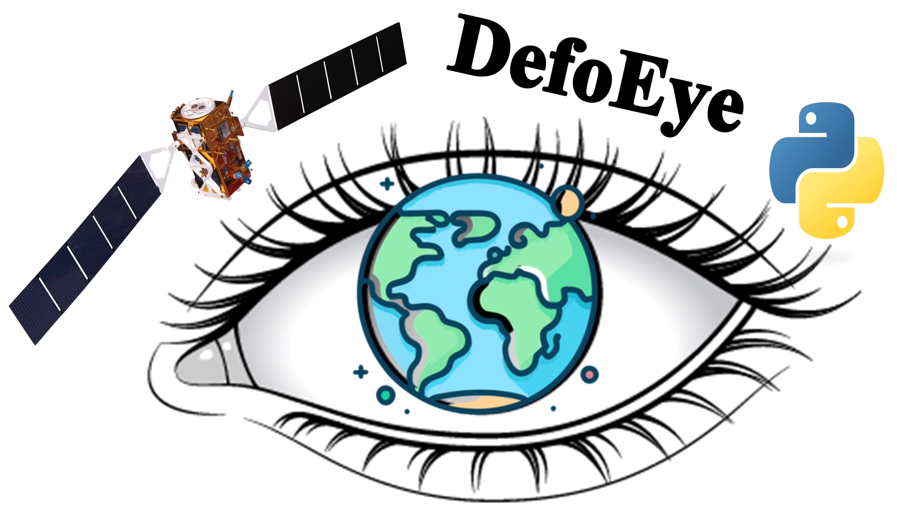

🛑 **important**: The corresponding paper is currently under review. For software illustrations, please refer to [here](docs/Step-by-Step.pdf). Please cite the paper once published when using WQEye in your work.

  

### DefoEye: A Python-Based Software for Facilitated Time-Series InSAR Analysis of Sentinel-1 Remote Sensing Data
---------------------------------------------------------------------------------------------
### 📝 Software Documentation

🛠️ For installation instructions, refer to the **Installation Guide** [here](docs/Installation.pdf).
📚 A detailed **Step-by-Step Tutorial** can be found [here](docs/Step-by-Step.pdf).
---------------------------------------------------------------------------------------------

### 📁 Getting Started with Sample Data

A sample datasets are included with this repository ([here](example/)) to help you get started with **DefoEye**. 
These datasets provides dense time series **Chl-a** and **turbidity** measurements from in-situ USGS stations in USA.
They allow you to run the software, test its functionalities, and follow the tutorial, even if you don't have your own data yet. You can also download S1 data of your own study region using DefoEye and start the TS-InSAR analysis!

---------------------------------------------------------------------------------------------

### 👨‍💻 Development Team and Contact

- **Alireza Taheri Dehkordi** — Lund University, Lund, Sweden.

📧 For questions or inquiries, please contact: [alireza.taheri_dehkordi@tvrl.lth.se].

---------------------------------------------------------------------------------------------

### 🙏 Acknowledgements

We gratefully acknowledge the entire open-source community that made the development of **DefoEye** possible. Specific thanks to the following tools:

- 🖥️ **[Streamlit](https://streamlit.io/)** — for building interactive web applications.  
- 🌍 **[GMTSAR](https://topex.ucsd.edu/gmtsar/)** — for providing an open-source TS-InSAR processing tool, which is wrapped by DefoEye.
