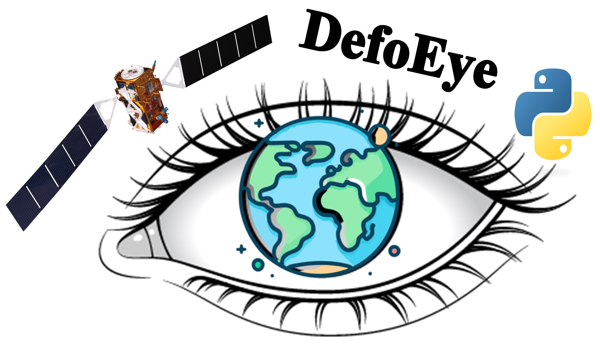
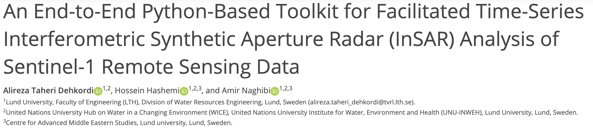

🛑 **important**: Please cite the corresponding papers if you are using the software. For software illustrations, please refer to [here](docs/Step-by-Step.pdf).

  

### DefoEye: A Python-Based Wrapper for Facilitated Time-Series InSAR Analysis of Sentinel-1 Remote Sensing Data
---------------------------------------------------------------------------------------------
### 📝 Corresponding papers

#### 1- [EGU2026](https://meetingorganizer.copernicus.org/EGU26/EGU26-3070.html)

**How to cite:** Taheri Dehkordi, A., Hashemi, H., and Naghibi, A.: An End-to-End Python-Based Toolkit for Facilitated Time-Series Interferometric Synthetic Aperture Radar (InSAR) Analysis of Sentinel-1 Remote Sensing Data, EGU General Assembly 2026, Vienna, Austria, 3–8 May 2026, EGU26-3070, https://doi.org/10.5194/egusphere-egu26-3070, 2026.

  

---------------------------------------------------------------------------------------------
### 📝 Software Documentation

🛠️ GMTSAR is needed to run DefoEye as its wrapper, refer to the **Installation Guide** [here](docs/GMTSAR_Installation.pdf).

🛠️ For installation instructions, refer to the **Installation Guide** [here](docs/Installation.pdf).

📚 A detailed **Step-by-Step Tutorial** can be found [here](docs/Step-by-Step.pdf).

---------------------------------------------------------------------------------------------

### 📁 Getting Started

A sample dataset is included with this repository ([here](examples/)) to help you get started with **DefoEye**. 

This allows you to run the software, test its functionalities, and follow the tutorial.

You can also download S1 data of your own study region using DefoEye and start the TS-InSAR analysis!

---------------------------------------------------------------------------------------------

### 👨‍💻 Development Team and Contact

- **Alireza Taheri Dehkordi** — Lund University, Lund, Sweden.

📧 For questions or inquiries, please contact: [alireza.taheri_dehkordi@tvrl.lth.se].

---------------------------------------------------------------------------------------------

### 🙏 Acknowledgements

We gratefully acknowledge the entire open-source community that made the development of **DefoEye** possible. Specific thanks to the following tools:

- 🖥️ **[Streamlit](https://streamlit.io/)** — for building interactive web applications.  
- 🌍 **[GMTSAR](https://topex.ucsd.edu/gmtsar/)** — for providing an open-source TS-InSAR processing tool, which is wrapped by DefoEye.
